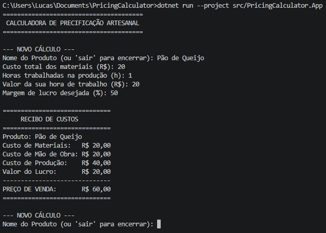

# 🧮 PricingCalculator CLI

> Uma aplicação simples de linha de comando (CLI) para auxiliar pequenos empreendedores no cálculo correto de custos e preços de venda, garantindo a lucratividade do negócio.

---

# 1. Nome do projeto
PricingCalculator CLI (Calculadora de Precificação Artesanal)

# 2. Descrição do problema real
No Brasil, milhares de pessoas trabalham por conta própria produzindo artesanato, bolos, doces e roupas. Uma das maiores dores desses microempreendedores é a precificação. Muitos calculam apenas o custo dos materiais (ignorando o valor da própria hora de trabalho e despesas invisíveis), o que resulta em preços de venda muito baixos, margens de lucro negativas e, eventualmente, falência.

# 3. Proposta da solução
Uma ferramenta de linha de comando (CLI) inteligente que atua como um assistente financeiro. Através de um fluxo simples no terminal, o usuário insere os custos do material, o tempo gasto e a margem de lucro desejada. A aplicação faz o cálculo e devolve um "Recibo de Custos" claro, mostrando o custo real de produção e o preço de venda final sugerido.

# 4. Público-alvo
Pequenos artesãos, confeiteiros, padeiros independentes, costureiros e qualquer trabalhador autônomo que precise calcular o valor de sua hora técnica e evitar prejuízos.

# 5. Funcionalidades principais
- Cálculo automático de custo de mão de obra baseado em horas trabalhadas.
- Cálculo da margem de lucro percentual sobre o custo total de produção.
- Bloqueio e validação contra a inserção de valores financeiros negativos ou inválidos.
- Geração de um recibo formatado e detalhado direto no terminal.

# 6. Tecnologias utilizadas
- Linguagem: C# (.NET 10.0)
- Testes: xUnit
- Controle de Versão: Git e GitHub
- CI/CD: GitHub Actions
- Análise Estática (Linting): dotnet format

# 7. Instruções de instalação
1. Instale o .NET SDK 10.0 no seu computador.
2. Instale o Git para conseguir baixar o repositório via terminal.
3. Abra o terminal e rode o comando: `git clone https://github.com/lucas-kauanogb/PricingCalculator.git`
4. Acesse a pasta do projeto com o comando: `cd PricingCalculator`
5. Restaure as dependências rodando: `dotnet restore`

# 8. Instruções de execução
Com o terminal aberto na pasta raiz do projeto, digite o seguinte comando e aperte Enter:
`dotnet run --project src/PricingCalculator.App`

# 9. Instruções para rodar os testes
Para executar a verificação automatizada, abra o terminal na pasta raiz do projeto e rode:
`dotnet test`

# 10. Instruções para rodar o lint
Para verificar a formatação do código baseada no `.editorconfig`, abra o terminal na pasta raiz do projeto e rode:
`dotnet format --verify-no-changes`

# 11. Versão atual
1.0.0

# 12. Nome do autor
Lucas Kauan de Oliveira Gomes Brandão

# 13. Link do repositório público
https://github.com/lucas-kauanogb/PricingCalculator